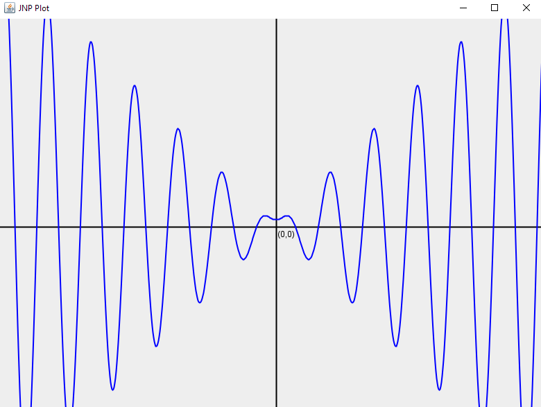

# Java Numerical Processing [WIP]

Java Numeric Processing (JNP) is a multithreaded numerical computing package for Java. JNP aims to provide efficient operations for dense matrices and tensors with support for complex valued data in the JVM while maintaining a robust object-oriented design. JNP is currently a work-in-progress and in active development.

## Current and Planned Features

- An N-Dimensional Array type for matrix and tensor operations
    - Data structure manipulation operations: Array resizing and reshaping, concatenation, transposition (for matrices), and slicing
    - Advanced indexing (similar to MATLAB logical indexing)
- Numerical Operations
    - Element-wise operations on N-dimensional data with support for complex valued data
    - Vector operations with support for complex valued vectors
    - Matrix Operations *(planned)*
    - Linear equations solvers *(planned)*
    - Numerical function integration and derivatives *(planned)*
- Graphing and visualization *(planned)*
    - a set of Java Swing components for plots and data visualization that can be easily integrated into GUI based applications *(planned)*
- Domain specific tools *(planned)*
    - I would like to add some domain specific functionality for signals and image processing, machine learning, and other fields.


## Documentation

All current functionality has been documented in javadoc comments in the source. More robust documentation will be made available when the tool reaches a more complete state.

## Demos

More in-depth demos and documentation will be made available when the tool reaches a more complete state. Here are some quick functionality demos:

### Basic data manipulation:
Create a random row and column vector:
```java
Numeric rowVector = Numeric.Rand( 1, 4 );
Numeric colVector = Numeric.Rand( 4, 1 );

System.out.println( rowVector );
System.out.println( colVector );
```
Output:
```
1x4 Array <Numeric>
[  0.3965  0.8773  0.2981  0.4134  ]

4x1 Array <Numeric>
[  0.6238  ]
[  0.9725  ]
[  0.5674  ]
[  0.9671  ]
```

Create a 2x4 matrix by concatenating the row vector with itself along the 0th (row) dimension.
```java
Numeric matrix = rowVector.concat( 0, rowVector );
System.out.println( matrix );
```
```
2x4 Array <Numeric>
[  0.3965  0.8773  0.2981  0.4134  ]
[  0.3965  0.8773  0.2981  0.4134  ]
```

Create a 3x4 matrix by concatenating the transpose of the column vector.
```java
matrix = matrix.concat( 0, colVector.transpose() );
System.out.println( matrix );
```
```
3x4 Array <Numeric>
[  0.3965  0.8773  0.2981  0.4134  ]
[  0.3965  0.8773  0.2981  0.4134  ]
[  0.6238  0.9725  0.5674  0.9671  ]
```

Reshape into a 2x6 matrix:
```java
matrix = matrix.reshape( 2, 6 );
System.out.println( matrix );
```
```
2x6 Array <Numeric>
[  0.3965  0.8773  0.2981  0.4134  0.3965  0.8773  ]
[  0.2981  0.4134  0.6238  0.9725  0.5674  0.9671  ]
```
Expand the 1st (column) dimension.
```java
matrix.resize( 2, 9 );
System.out.println( matrix );
```
```
2x9 Array <Numeric>
[  0.3965  0.8773  0.2981  0.4134  0.3965  0.8773  0.0000  0.0000  0.0000  ]
[  0.2981  0.4134  0.6238  0.9725  0.5674  0.9671  0.0000  0.0000  0.0000  ]
```

### Slicing and indexing

Create a 10x10 matrix.
```java
Numeric matrix = Numeric.Rand( 10, 10 );
System.out.println( matrix );
```
```
10x10 Array <Numeric>
[  0.8145  0.4199  0.0836  0.8485  0.8000  0.3177  0.4427  0.1207  0.7857  0.0603  ]
[  0.2164  0.2011  0.6299  0.4194  0.2847  0.0637  0.8694  0.5954  0.3255  0.2942  ]
[  0.4490  0.9887  0.7508  0.9403  0.5298  0.9896  0.1718  0.5403  0.6593  0.9540  ]
[  0.5082  0.1641  0.4453  0.3699  0.2321  0.2732  0.0205  0.5847  0.3965  0.2197  ]
[  0.0040  0.3668  0.0354  0.2405  0.3725  0.0029  0.2416  0.8775  0.6379  0.5948  ]
[  0.7303  0.8547  0.9954  0.7135  0.9801  0.5769  0.6543  0.5918  0.1025  0.5834  ]
[  0.3909  0.5934  0.4403  0.4798  0.4765  0.7816  0.5186  0.1060  0.5212  0.0319  ]
[  0.3787  0.9505  0.4516  0.2774  0.5172  0.1168  0.7896  0.1634  0.6183  0.4643  ]
[  0.6386  0.5915  0.0199  0.9028  0.2993  0.3840  0.3881  0.1995  0.2334  0.5687  ]
[  0.3849  0.0759  0.1741  0.5927  0.2101  0.8162  0.5438  0.1092  0.7767  0.0869  ]
```


Get a 4x5 slice of the last 4 rows and last 5 columns.
```java
Numeric slice = matrix.slice( new int[]{6,10}, new int[]{5,10} );
System.out.println( slice );
```
```
4x5 Array <Numeric>
[  0.7816  0.5186  0.1060  0.5212  0.0319  ]
[  0.1168  0.7896  0.1634  0.6183  0.4643  ]
[  0.3840  0.3881  0.1995  0.2334  0.5687  ]
[  0.8162  0.5438  0.1092  0.7767  0.0869  ]
```

Create a mask for all the elements in the matrix >= 0.5.
```java
Logical mask = Element.greq( slice, Numeric.Scalar( 0.5 ) );
System.out.println( mask );
```
```
4x5 Array <Logical>
[ 1 1 0 1 0 ]
[ 0 1 0 1 0 ]
[ 0 0 0 0 1 ]
[ 1 1 0 1 0 ]
```

Get a vector with only elements >= 0.5.
```java
Numeric elements = slice.get( mask );
System.out.println( elements );
```
```
1x9 Array <Numeric>
[  0.7816  0.5186  0.5212  0.7896  0.6183  0.5687  0.8162  0.5438  0.7767  ]
```

### Element-wise Operations

Create a 5x5 matrix.
```java
Numeric matrix = Numeric.RandComplex( 5, 5 );
System.out.println( matrix );
```
```
5x5 Array <Numeric>
[   0.9233 +0.5330i   0.7210 +0.4225i   0.5493 +0.2910i   0.3486 +0.1879i   0.1821 +0.9264i   ]
[   0.0829 +0.5660i   0.3594 +0.9800i   0.6073 +0.9082i   0.3132 +0.3951i   0.8343 +0.8581i   ]
[   0.9029 +0.1563i   0.8597 +0.5054i   0.0453 +0.3708i   0.1828 +0.1735i   0.9205 +0.7533i   ]
[   0.7738 +0.6834i   0.5341 +0.2503i   0.3845 +0.8570i   0.7930 +0.8476i   0.0922 +0.9642i   ]
[   0.1134 +0.4378i   0.4449 +0.7994i   0.7209 +0.9965i   0.7296 +0.0792i   0.2250 +0.2129i   ]
```

Compute sinh(z) + cos(z).
```java
matrix = Element.add( Element.sinh(matrix), Element.cos(matrix) );
System.out.println( matrix );
```
```
5x5 Array <Numeric>
[   1.6040 +0.2950i   1.5353 +0.2340i   1.4423 +0.1772i   1.3060 +0.1337i   1.5465 +0.6199i   ]
[   1.2305 +0.4887i   1.6273 +0.4821i   1.5808 +0.3458i   1.3204 +0.2790i   1.5456 +0.3189i   ]
[   1.6450 +0.1003i   1.5862 +0.2750i   1.1107 +0.3456i   1.1792 +0.1439i   1.5558 +0.3370i   ]
[   1.5506 +0.3145i   1.4302 +0.1551i   1.5467 +0.4502i   1.5508 +0.3192i   1.5482 +0.7219i   ]
[   1.1933 +0.3756i   1.5272 +0.4072i   1.5826 +0.2952i   1.5414 +0.0482i   1.2188 +0.1688i   ]
```

Graph f(x) = cos(x) + x*sin(x) for x = [-50,50].
```java
Numeric X = Numeric.LinSpace( -50, 50, 1000 );
Numeric Y = Element.add( Element.cos(X), Element.mul( X, Element.sin(X) ) );

JFrame frame = new JFrame();
frame.setSize(800, 600);
frame.setTitle("JNP Plot");
frame.setDefaultCloseOperation(JFrame.EXIT_ON_CLOSE);
frame.setLocationRelativeTo(null);

LinePlot plot = new LinePlot( X, Y, 800, 600 );
frame.add(plot);
frame.setVisible(true);
```

